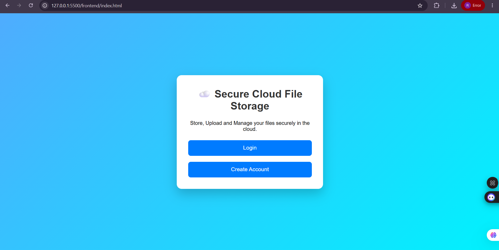
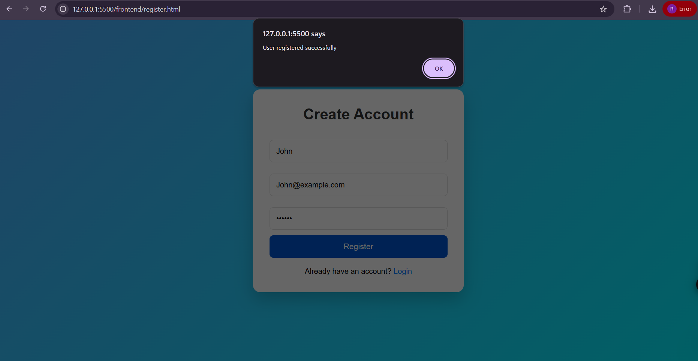
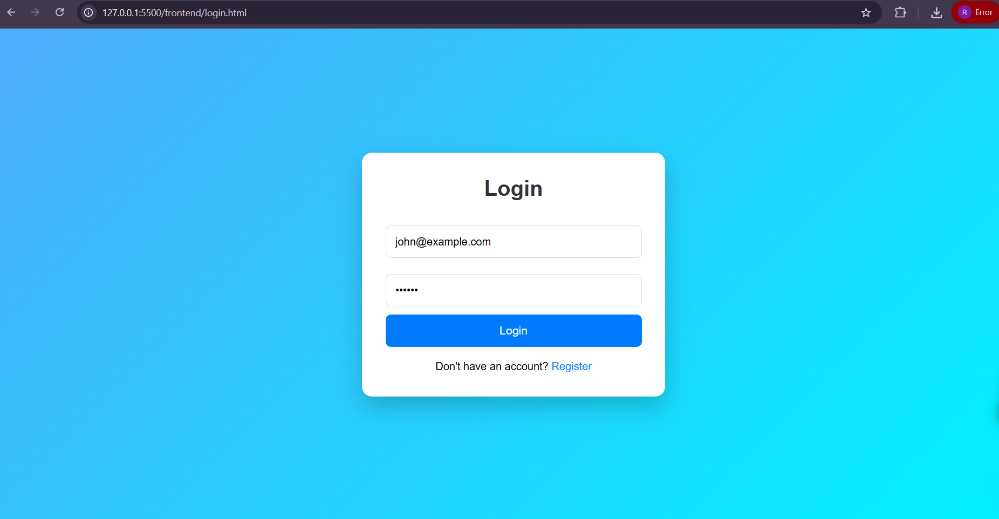
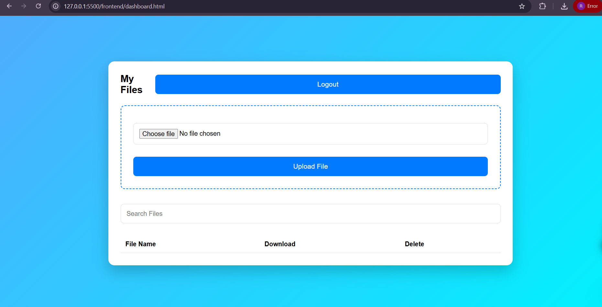
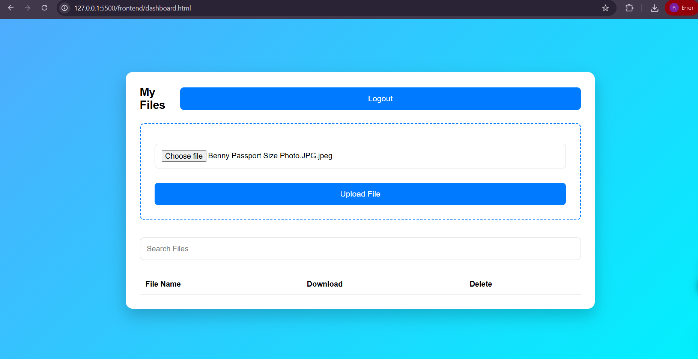
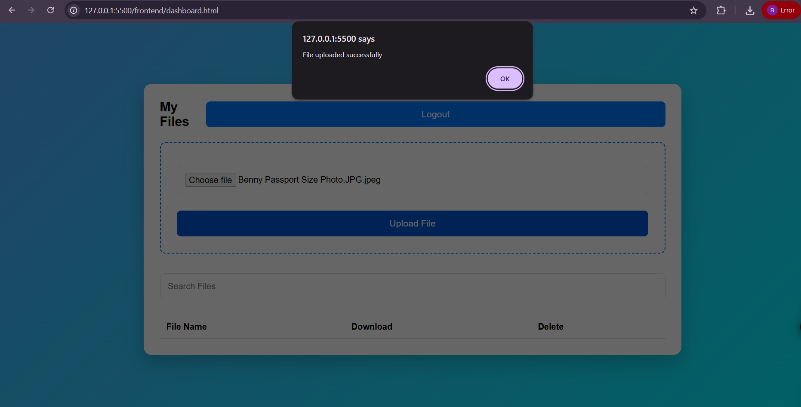
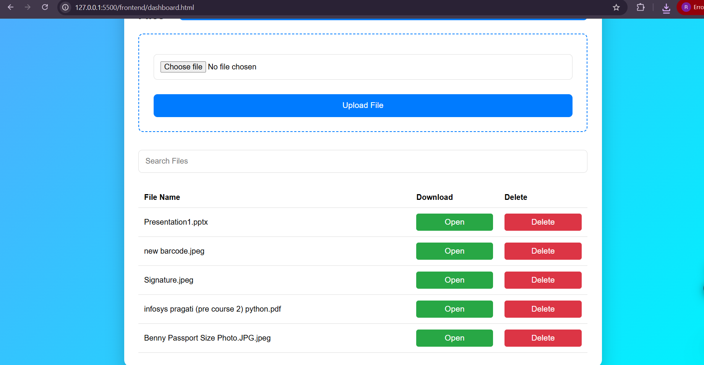
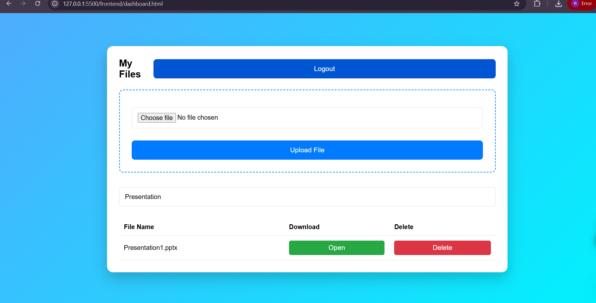
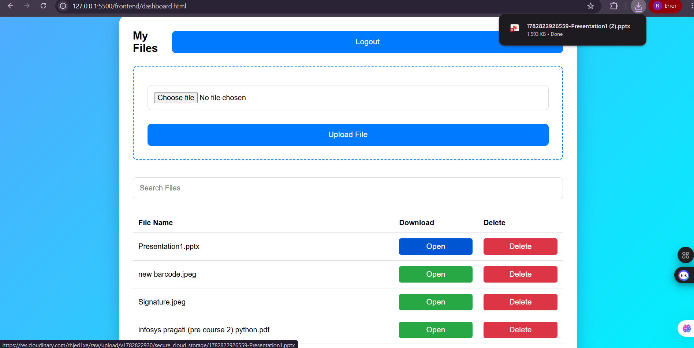
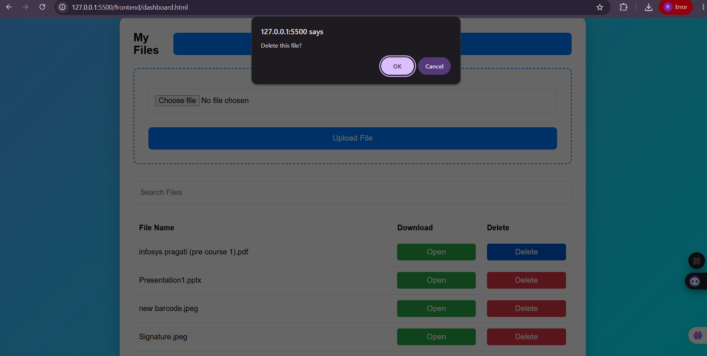

# ☁️ Secure Cloud File Storage System

A secure cloud-based file storage application that allows users to register, log in, upload files to Cloudinary, view uploaded files, search files, and delete files. The application uses JWT authentication to ensure secure access.

# ☁️ Secure Cloud File Storage System


- bcrypt.js

---

## 📂 Project Structure

```
secure-cloud-file-storage-system/
│
├── backend/
│   ├── config/
│   ├── middleware/
│   ├── models/
│   ├── routes/
│   ├── package.json
│   └── server.js
│
├── frontend/
│   ├── css/
│   ├── js/
│   ├── index.html
│   ├── login.html
│   ├── register.html
│   └── dashboard.html
│
└── README.md
```

---

## ⚙️ Installation

### Clone Repository

```bash
git clone https://github.com/Bency-Hanita-Angelica-K/secure-cloud-file-storage-system.git
```

### Backend Setup

```bash
cd backend
npm install
```

Create a `.env` file inside the `backend` folder.

Example:

```env
PORT=5000
MONGO_URI=your_mongodb_connection_string
JWT_SECRET=your_secret_key
CLOUDINARY_CLOUD_NAME=your_cloud_name
CLOUDINARY_API_KEY=your_api_key
CLOUDINARY_API_SECRET=your_api_secret
```

Start the backend:

```bash
npm run dev
```

---

### Frontend

Open `frontend/index.html` using Live Server.

---

## 📸 Project Screenshots

### 🏠 Home Page



---

### 📝 Register Page



---

### 🔑 Login Page



---

### 📊 Dashboard



---

### 📂 Choose File



---

### ☁️ Upload File



---

### 📋 File List



---

### 🔍 Search File



---

### 📄 Open File



---

### 🗑️ Delete File



---

## 🔒 Authentication Flow

1. User registers.
2. Password is encrypted using bcrypt.
3. User logs in.
4. JWT token is generated.
5. Token is stored in browser localStorage.
6. Protected routes verify the JWT token.
7. Authenticated users can upload, view, search, and delete files.

---

## 📌 Future Enhancements

- File Sharing
- File Preview
- Folder Management
- Multiple File Upload
- File Size & Type Validation
- Drag and Drop Upload
- User Profile
- Admin Dashboard

---

## 👨‍💻 Author

**Bency Hanita Angelica K**

GitHub:
https://github.com/Bency-Hanita-Angelica-K
